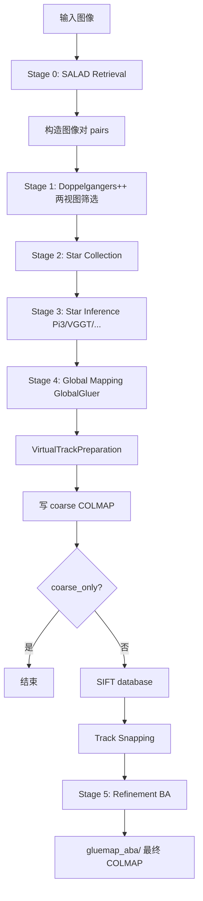

# GLUEMAP Pipeline Summary
> 面向 AI / 新贡献者的快速参考。描述 `gluemap-demo` 默认 pipeline 的数据流、关键模块与实现细节。  
> 主 orchestrator：`gluemap/controllers/gluemap_impl.py`（`GluemapPipeline`）。
---
## 1. 项目目标
**输入：** 一组无序或有序图像  
**输出：** COLMAP 格式稀疏重建（`cameras.txt` / `images.txt` / `points3D.txt`）
核心思路：用 **feedforward 多视图模型**（Pi3 / VGGT / MapAnything）做局部 robust 重建，再用 **经典 global SfM**（rotation averaging、similarity averaging、SIFT、BA）做全局一致性与精化。
---
## 2. 入口与目录结构
### CLI 入口
```bash
gluemap-demo --config configs/example.yaml --images_path ... --write_path results/
```
代码路径：`gluemap/cli.py` → `demo_main()`
```text
parse_args_with_config
  → init_distributed (多 GPU)
  → run_preprocessing_pipeline (SALAD)
  → 构造 TwoView Dataset
  → run_inference_pipeline (GluemapPipeline.run)
```

### 关键源码映射
| 阶段 | 主要文件 |
|------|----------|
| CLI / 配置 | `gluemap/cli.py`, `gluemap/utils/cli.py`, `configs/base.yaml` |
| Retrieval | `gluemap/controllers/image_retrieval.py` |
| Two-view | `gluemap/controllers/twoview_inference.py`, `gluemap/datasets/twoview.py` |
| Star 构建 | `gluemap/controllers/star_collection.py`, `gluemap/datasets/star.py` |
| Star 推理 | `gluemap/controllers/star_inference.py`, `gluemap/ff_inference/*` |
| Global 融合 | `gluemap/controllers/global_merger.py` |
| 旋转平均 | `gluemap/estimators/rotation_averaging.py` |
| 内参平均 | `gluemap/estimators/intrinsics_averaging.py` |
| 相似变换 | `gluemap/estimators/similarity_averaging.py` |
| Virtual tracks | `gluemap/estimators/virtual_tracks.py` |
| Track snap | `gluemap/estimators/track_snapping.py` |
| Refinement | `gluemap/controllers/global_refinement.py` |
| Augmented BA | `gluemap/controllers/augmented_bundle_adjustment.py` |
| COLMAP IO | `gluemap/utils/colmap.py` |

---

## 3. 总览流程图

---

## 4. 各阶段详解
### Stage 0：Retrieval（预处理）
**模块：** `SaladRetrievalPipeline` / `run_preprocessing_pipeline`  
**模型：** SALAD（DINO 全局描述子），checkpoint `path_retrieval`
| 项 | 细节 |
|----|------|
| 输入分辨率 | 322×322 |
| batch | `retrieval_batch_size`（默认 30） |
| 输出缓存 | `write_path/salad_descriptors.pt` |
| 多 GPU | rank 0 计算，其他 rank `synchronize` 等待 |

**配对策略（Dataset 层，非本 stage）：**
| Dataset 类 | 场景 | 配对 |
|------------|------|------|
| `BaseTwoViewDataset` | 普通无序集 | FAISS 近邻，`num_neighbors=100` |
| `SequentialTwoViewDataset` | 视频 | 时序窗口 + 全局检索，`num_neighbors_sequential=30` |
| `MultiSequencePairs` | 多序列（LaMAR） | 序列内时序 + 跨序列 FAISS |
---

### Stage 1：Two-view Inference
**模块：** `TwoViewInferencePipeline` / `run_twoview_inference`  
**模型：** Doppelgangers++（`AsymmetricMASt3R`），checkpoint `path_dg`  
**注意：** 与 `chosen_model`（Pi3/VGGT）无关；仅做共视/重复结构判别。
| 项 | 细节 |
|----|------|
| batch | `batch_size`（默认 30）= **30 对**图像，tensor `(B, 2, ...)` |
| 跳过 | `skip_doppelgangers=true` → 所有 pair score=1.0 |
| 缓存 | `twoview_result.pth` |
| 多 GPU | 按 pair index 分 shard，gather 到 rank 0 |
**输出：** 每对 `(i,j)` 的 score ∈ [0,1]；后续 `valid_dg_threshold=0.8` 过滤。
---
### Stage 2：Star Collection
**模块：** `StarCollector` / `run_star_collection`
1. 用 Doppelgangers score 建共视图；不连通则降阈值或取最大连通分量
2. 每张图 `i` 以自身为中心，邻居剪枝到 `MAX_NEIGHBORS=25`（视频模式优先保留时序邻居）
3. 生成 `BaseStarDataset`：`stars[i] = [center, n1, n2, ...]`
**Star 含义：**
- **不是 keyframe 筛选**；连通分量内几乎每张有邻居的图都会当一次 center
- N 张图、全有邻居 → **N 个 star**，Star Inference **N 次 forward**（非 N×N）
- 每张图会在多个 star 里当 neighbor，也会在自己的 star 里当 center
**日志（`star.py`）：** `Built {num_stars} star graphs from {N} images (avg X views/star, Y without neighbors)`
---

### Stage 3：Star Inference
**模块：** `StarInferencePipeline` / `run_star_inference`  
**模型：** `chosen_model`（pi3 / pi3x / vggt / map_anything）+ VGGSfM tracker（`path_tracker`）
| 项 | 细节 |
|----|------|
| batch_size | **固定 1**（一次 1 个 star） |
| 每 star 图数 | 2～26（1 center + 最多 25 neighbors） |
| 输入分辨率 | 518×518（patch_size=14） |
| query keypoints | ALIKED，`num_track_per_img=1024` |
| 缓存 | `star_result.pth` |

**每个 star 一次 forward 产出：**
| 字段 | 含义 |
|------|------|
| `indexes` | star 成员 global image id |
| `extrinsics` / `intrinsics` | 局部 `(1, N, 3, 4)` / `(1, N, 3, 3)` |
| `pose_scores` | 边/邻居置信度 |
| `tracks` / `vis` / `conf` | VGGSfM 2D track |
| `points3d_virtual` / `tracks_virtual` / `valid_virtual` | virtual 3D 及投影（CovisibilityExtraction） |
**注意：** raw `depth` 在 CovisibilityExtraction 内消费，一般不持久化进 `star_result.pth`。
---
### Stage 4：Global Mapping（仅 rank 0）
**模块：** `GluemapPipeline.run_postprocessing` → `GlobalGluer.main`
发生在 star inference 之后；输入为 **star 局部预测**，输出 **全局一致** 相机位姿 + 内参。
#### 4.1 坐标还原 `restore_image_shape`
将 tracks、intrinsics 从 518 预处理尺寸缩回原图分辨率。


#### 4.2 `_refine_graph_structure`（图清洗）
| 子步 | 作用 |
|------|------|
| vis → scores | track visibility > 0.05 保留 |
| `_filter_inconsistent_edges` | 双向相对位姿互逆检查（旋转 10°、平移方向 30°）；不一致则 **pose_scores=0** |
| `_collect_valid_edges` | pose_scores > 0.05 的边 |
| `_connect_missing` | 跨连通分量弱补边（+0.01 score） |
| `_prune_invisible_pairs` | **物理删除** pose_scores≤0 的邻居（extrinsics/tracks 等同裁列） |
**pose_scores=0 的下游影响：** 不进 rotation averaging / similarity averaging / MST；该边约束被丢弃。
#### 4.3 `_estimate_intrinsics`

**模块：** `intrinsics_averaging`
- 从所有 star 收集每张图的 K，按 `intrinsics_mapping` 分桶
- `intrinsics_mode`：`SHARED`（同分辨率共 camera）/ `PER_FOLDER` / `PER_CAMERA`
- `SIMPLE*` 模型：先 fx=fy，再对桶内观测取 **median**
- 输出：`global_intrinsics[camera_id]` → `(1, 3, 3)`
#### 4.4 `_global_structure_estimation`
**旋转：** 默认 `rotation_averaging_pycolmap`


1. 无向边去重，每对图保留 score 最高的一条
2. 建 `pycolmap.PoseGraph`，边权 `num_matches = score × 1000`
3. `run_rotation_averaging`（L1+IRLS，Geman-McClure，默认 5° 阈值）
4. 输出 `global_rotations[i]`：world→camera 的 3×3 矩阵

**平移/尺度：**
1. `initialize_mst_structures`：MST 初始化 `global_centers` + per-star scale
2. `similarity_averaging`：Ceres 优化相机中心与 per-star scale；并 `points3d_virtual /= global_scales[star]`


**输出：**
- `global_rotations[i]`：每张图全局旋转
- `global_centers[i]`：每张图相机中心（世界坐标）
- 二者是 **fusion 解**，不是预先存在的变换矩阵；按 **image id** 索引，非 star id
#### 4.5 `VirtualTrackPreparation`

**模块：** `gluemap/estimators/virtual_tracks.py`
1. `_update_virtual_tracks`：局部 extrinsics + 全局 K → 投影得 2D virtual tracks
2. `_subsample_virtual_tracks`：~1024 → ~100 条/star
3. `_update_virtual_tracks_global`：前 10% 用全局 R/C 重投影；`pose_inconsistent` 边额外补投影

#### 4.6 写 coarse
`write_to_colmap_format` → `write_path/coarse/`（相机位姿 + 内参，点云不完整）  
`coarse_only=true` 在此结束。
---

### Stage 5：Refinement（仅 rank 0）
**前置：** `prepare_sift_database` → `database_sift.db`；`TrackSnapping` 将 VGGSfM `tracks` snap 到最近 SIFT 点（默认 thres=1px@1024，按 `(H+W)/1024` 缩放）。
**模块：** `run_refinement_pipeline`（`global_refinement.py`）
**默认：** `track_mode="SPV"`，`num_refinement_iterations=2`
| 字母 | 来源 |
|------|------|
| S | SIFT（`database_sift.db`） |
| P | Prior（snap 后的 VGGSfM real tracks） |
| V | Virtual tracks |
#### Setup（一次）
1. 读 `coarse/`
2. `prepare_glomap_prior` → `database_tracks.db`（含 prior tracks）
3. `merge_colmap_databases` + SIFT → `database_merged.db`（SIFT 特征索引在前）
4. `establish_tracks_from_predictions_dict`：内存中建 track / virtual 结构
5. `initialize_world_points`：3D 初值
6. `build_reconstruction_for_ba` → `virtual_reconstruction`
#### 迭代（默认 2 轮）


每轮：
1. `triangulate_with_pycolmap`：对 merged db 三角化 → `reconstruction`
2. `select_tracks_from_merged`：prune 非 SIFT 主导 track（pygluemap）
3. `select_virtual_tracks_from_merged`：按 pair 覆盖 prune virtual
4. `filter_reconstruction_by_reprojection_error`（角度 0.5°）
5. 可选 `max_num_tracks` 截断
6. `iterative_bundle_adjustment`：real + virtual 联合 Augmented BA
#### 输出
`write_path/gluemap_aba/` — 最终 COLMAP 稀疏重建。

---
## 5. 并行与 rank 分工
| 阶段 | 多 GPU |
|------|--------|
| Retrieval | rank 0 算，其他 wait |
| Two-view | 分布式 batch |
| Star | 分布式 batch（按 star index） |
| Global + Refine | **仅 rank 0** |


启动：`torchrun --nproc_per_node=N gluemap-demo ...`


---
## 6. 磁盘产物
```text
write_path/
├── star_result.pth           # Stage 3 → Global Mapping 主输入
├── pipeline_timing.pth
├── coarse/                   # Stage 4 粗重建
├── database_sift.db          # SIFT
├── database_tracks.db        # prior tracks
├── database_merged.db        # 合并
└── gluemap_aba/              # Stage 5 最终结果
```

**断点续跑：** `rerun_from: retrieval | twoview | star` 删除对应缓存重跑。
---
## 7. 关键配置（`configs/base.yaml`）

| Key | 默认 | 说明 |
|-----|------|------|
| `chosen_model` | pi3 | Star 多视图 backbone |
| `path_feedforward` | checkpoints/pi3.safetensors | backbone 权重 |
| `path_retrieval` / `path_dg` / `path_tracker` | SALAD / DG / VGGSfM | 各阶段模型 |
| `num_neighbors` | 100 | 检索近邻数 |
| `batch_size` | 30 | Two-view batch（对数） |
| `valid_dg_threshold` | 0.8 | Doppelgangers 边阈值 |
| `valid_pose_threshold` | 0.05 | Global 图有效边 |
| `intrinsics_mode` | SHARED | 内参分桶 |
| `coarse_only` | false | 跳过 refinement |
| `skip_doppelgangers` | false | 跳过 Stage 1 |
| `use_dummy_tracks` | false | 跳过 VGGSfM tracker |

---
## 8. 核心数据结构约定
### predictions_dict（star 推理 / postproc 主载体）
- 列表长度 = **star 个数**（≈ 有邻居的图像数）
- `predictions_dict["indexes"][star_idx]`：该 star 成员 global image id， `[0]` 为 center
- `extrinsics[star_idx]`：star **局部**坐标系相对位姿；global 融合后仍保留作约束，similarity averaging 会按 scale 缩放平移部分

### 索引
- Python 侧（`global_rotations`、track dict）：**0-indexed** image id
- COLMAP db / `Reconstruction`：**1-indexed** image_id / camera_id（边界 +1）

### global_rotations / global_centers
- 按 **image id** 索引，非 star id
- `global_rotations[i]`：world→camera 旋转；`global_centers[i]`：相机中心在世界系
- 将局部 3D 变全局：除用各成员 `R_i, C_i` 外，virtual 3D 还需除以该 star 的 `global_scales[star]`
---

## 9. 模型分工速查
| 阶段 | 模型 | 可配置 |
|------|------|--------|
| Retrieval | SALAD | 固定 |
| Two-view | Doppelgangers++ (MASt3R) | 可 skip |
| Star | Pi3 / Pi3X / VGGT / MapAnything | `chosen_model` |
| Star tracking | VGGSfM | 可 `use_dummy_tracks` |
| Rotation avg | pycolmap L1+IRLS（或 Ceres 可选） | `use_ceres_rotation_averaging` |
| BA | pycolmap + pygluemap Augmented BA | — |
---

## 10. 与经典 COLMAP SfM 的差异（一句话）
GLUEMAP 用 **feedforward star 推理** 替代传统 local geometric verification + incremental mapping 的位姿初值来源，但仍依赖 **rotation/similarity averaging + SIFT + BA** 做 global consistency 与 final refinement。
---
## 11. 相关论文与仓库
- 项目页：https://lpanaf.github.io/cvpr26_gluemap/
- 论文：https://arxiv.org/abs/2605.26103
- GitHub：https://github.com/colmap/gluemap