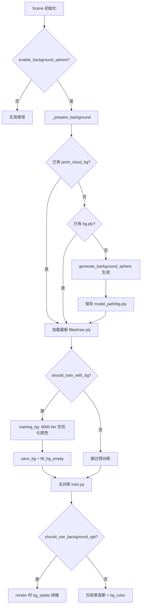

# GGGS 背景球（Background Sphere）逻辑 Summary

## 1. 设计目标

背景球是一套**独立于前景场景**的高斯点云，放在场景外围的大球面上，用来：

1. **预训练天空/远景颜色**（背景专用阶段）
2. **主训练早期**可选地参与 RGB 渲染，补全未覆盖区域
3. 提供 **`scene_scale`**，用于后期 prune 远离场景的前景高斯

---

## 2. 核心组件

| 组件 | 文件 | 作用 |
|------|------|------|
| `GaussianBackgroundModel` | `scene/gaussian_bg_model.py` | 轻量背景高斯模型，仅优化颜色 |
| `Scene._prepare_background()` | `scene/__init__.py` | 初始化/加载背景球 |
| `generate_background_sphere()` | `scene/__init__.py` | 从点云生成单位球并缩放 |
| `training_bg()` | `train.py` 等 | 背景预训练 |
| `render(..., bg_splats=...)` | `gaussian_renderer/__init__.py` | 前景+背景联合光栅化 |

---

## 3. 配置开关

| 参数 | 默认值 | 含义 |
|------|--------|------|
| `enable_background_sphere` | `True` | 是否创建背景高斯模型 |
| `train_with_background_rgb` | `False` | 主训练是否把背景球拼进渲染 |
| `bg_iterations` | `4000` | 背景预训练迭代数 |

定义位置：`arguments/__init__.py`

---

## 4. 训练流程总览



---

## 5. 背景球生成（`_prepare_background`）

### 加载优先级

1. `point_cloud_bg/iteration_*/point_cloud.filled.ply`（优先）
2. 否则 `point_cloud_bg/iteration_*/point_cloud.ply`
3. 否则 `model_path/bg.ply`
4. 否则从 SfM 点云现场生成

### 生成逻辑（`generate_background_sphere(xyz, distance=0.75)`）

- 点云取 99.5% 分位去 outlier，算 bbox 对角线得 `scene_size`
- `scene_scale = clamp(scene_size × 0.75, 50, 10000)`
- 模板来自 `scene/unit_sphere.ply`，整体缩放
- 初始颜色：白色 SH DC；opacity ≈ 0.99（`4.595121`）；rotation 单位四元数

### 禁用条件（`should_train_with_bg = False`）

- 无点云
- `generate_background_sphere` 失败
- `fill_bg_empty` 发现 >60% 点仍为默认空色（未训练）

---

## 6. 背景预训练（`training_bg`）

在主训练**之前**执行，仅当 `should_train_with_bg && bg_iterations > 0`。

| 项目 | 行为 |
|------|------|
| 优化参数 | **仅 `_features_dc`（颜色）** |
| 冻结 | xyz、scale、rotation、opacity、SH rest |
| 渲染 | 单独渲染背景高斯（`pc=bg_gaussians`） |
| 损失 | L1 + λ·(1−SSIM)，对**整图 GT** |
| 保存 | `point_cloud_bg/iteration_{bg_iterations}/point_cloud.ply` |

### `fill_bg_empty`

训练只覆盖相机可见半球，另一半用默认 SH 值 `1.77245378`。保存后按 y>0 / y<0 半球分别用已训练点的平均色填充，输出 `point_cloud.filled.ply`。

---

## 7. 主训练中的使用（`train.py`）

### 7.1 是否启用背景 RGB（`should_use_background_rgb`）

需同时满足：

- `train_with_background_rgb=True`
- `should_train_with_bg=True`
- **无 mask 先验**
- 迭代在 cutoff 之前（反射场景 3000，普通 7000）

### 7.2 渲染拼接

- 前景 `GaussianModel` + 背景 `bg_splats` 一次光栅化
- 背景无 3D filter、无 SG，SG 通道填 0
- 未被高斯覆盖的像素仍用 `bg_color`（白/黑）填充
- 主训练**不更新**背景参数（无 bg optimizer step），背景相当于固定外观

关键代码：`gaussian_renderer/__init__.py` 中 `means3D`、`scales`、`opacity` 等与 `bg_splats` 做 `torch.cat`。

### 7.3 `scene_scale` 与 prune

`final_prune_fastgs` 会删除距原点 > `1.5 × scene_scale` 的前景高斯，避免远景 floaters。

---

## 8. 其他训练脚本差异

| 脚本 | 背景 RGB 启用策略 |
|------|-------------------|
| `train.py` | `should_use_background_rgb()`：反射 3k / 普通 7k 截止 |
| `three_stage_train.py` / `train_scene.py` | 仅 **init 阶段** `use_background_rgb=True` |
| `train_mask.py` 等 | 有 mask 时关闭背景 RGB |

---

## 9. 推理（`render.py`）

需显式 `--render_with_background`，才会加载并拼接背景球。

---

## 10. 产物目录

```
model_path/
├── bg.ply                          # 初始生成的背景球
├── point_cloud_bg/
│   └── iteration_4000/
│       ├── point_cloud.ply         # 预训练原始输出
│       └── point_cloud.filled.ply  # 半球填充后（后续加载优先用这个）
└── point_cloud/
    └── iteration_*/                # 前景高斯（与背景分开存）
```

---

## 11. 典型用法

**仅预训练背景、主训练不用背景 RGB（默认）：**

```bash
python train.py -s <scene> -m <output>
```

**主训练早期也拼背景：**

```bash
python train.py -s <scene> -m <output> --train_with_background_rgb
```

**推理带背景：**

```bash
python render.py -m <output> --render_with_background
```

---

## 12. 设计要点小结

1. **两阶段分离**：背景先单独训颜色；前景训几何/外观/法线等。
2. **背景球是尺度锚点**：半径定义 `scene_scale`，用于 prune 和 mesh 边界。
3. **主训练背景是可选、短期的**：默认关闭；即使开启也只在早期迭代、且无 mask 时生效。
4. **背景不参与 densify/prune**：只有前景 `GaussianModel` 做增删点。
5. **半球填充**：解决背景球只有一半被相机看到、另一半无梯度的问题。
