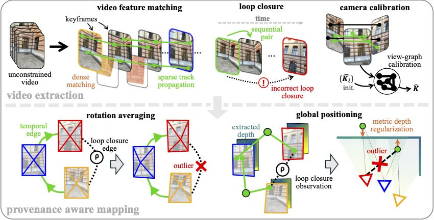

<h1 align="center">VidMap</h1>

<h3 align="center">Exploiting Temporal Structure for Video-Based Structure-from-Motion</h3>

<p align="center">
  <a href="https://www.linkedin.com/in/zador-pataki-a297b5196/">Zador&nbsp;Pataki</a>
  · <a href="https://psarlin.com/">Paul-Edouard&nbsp;Sarlin</a>
  · <a href="https://www.microsoft.com/en-us/research/people/mapoll/">Marc&nbsp;Pollefeys</a>
</p>

<p align="center"><strong>ECCV 2026</strong></p>

<p align="center">
  <a href="https://arxiv.org/abs/2607.27194">Paper</a> |
  <a href="https://youtu.be/gy4szd3q5Oo">Video</a>
</p>


<p align="center">
  
</p>

VidMap is an offline Structure-from-Motion system for video. It combines
temporal tracks, loop closures, metric depth, and global optimization to
estimate camera poses, camera intrinsics, and a sparse 3D map.

## Setup

We provide the Python package [`vidmap`](vidmap). From a clean Python environment,
clone VidMap and its pinned model dependencies:

```bash
git clone --recursive https://github.com/cvg/vidmap.git && cd vidmap
```

Build and install [COLMAP](https://github.com/colmap/colmap) 4.1 and its
PyCOLMAP bindings
[from source](https://colmap.github.io/install.html#build-from-source).
For GPU mapper acceleration, build them against
[Ceres 2.3 or newer](https://ceres-solver.readthedocs.io/latest/installation.html)
with CUDA and cuDSS instead ([see how to enable](#gpu-acceleration)).

Then install [PyTorch](https://docs.pytorch.org/get-started/locally/),
[xFormers](https://github.com/facebookresearch/xformers), and VidMap:

```bash
pip install -e .
```

VidMap was last tested on Linux x86-64 with Python 3.10, COLMAP and PyCOLMAP
4.1, PyTorch 2.7.1, TorchVision 0.22.1, and xFormers 0.0.31 on NVIDIA GPUs.

The first frontend run automatically downloads approximately 9 GB of model
checkpoints.

**Optional visualization setup.** Install [Rerun](https://rerun.io/):

```bash
pip install rerun-sdk
```

## Execution

The repository includes a silent example video. Run the frontend to build its mapper inputs, then
run mapping:

```bash
INPUT_DATA=./assets/example_video.mp4
OUTPUT_DIR=./example_output/
MAPPER_INPUTS="$OUTPUT_DIR/mapper_inputs"

python -m vidmap.frontend "$INPUT_DATA" \
  --output "$OUTPUT_DIR"

python -m vidmap.map \
  --mapper-inputs "$MAPPER_INPUTS" \
  --output "$OUTPUT_DIR"
```

Alternatively, run frontend and mapping together:

```bash
python -m vidmap.run \
  --input_data "$INPUT_DATA" \
  --output "$OUTPUT_DIR"
```

Alternatively, `--input_data` may point to a directory of extracted frames.

Both mapping commands write the final COLMAP model under `$OUTPUT_DIR/rec`.
Resolved `frontend_config.yaml` and `mapping_config.yaml` are written directly
under `$OUTPUT_DIR`.

## Visualization

### Browser viewer

Open the [vidmap-viewer](vidmap/visualization/vidmap-viewer.html) in a
Chromium-based browser and choose a run folder containing `rec/` and
`mapper_inputs/`. The viewer requires internet access.

<details>
<summary>[Embed a reconstruction - click to expand]</summary>

```bash
python -m vidmap.visualization.html --run-dir "$OUTPUT_DIR"
```

This embeds the reconstruction in `$OUTPUT_DIR/vidmap-viewer-embedded.html`, so
it opens without selecting a run folder.

</details>

<p align="center">
  
</p>

### Rerun playback

To render optimization playback, record solver states during mapping:

```bash
python -m vidmap.map \
  --mapper-inputs "$MAPPER_INPUTS" \
  --output "$OUTPUT_DIR" \
  --save-playback-trace
```

This writes the trace to `$OUTPUT_DIR/playback_trace/`.

Create solver-playback and flythrough recordings. Local images, frame timing,
and missing ground truth are detected automatically:

```bash
VISUALS=./example_visuals/

python -m vidmap.visualization.rerun.playback "$OUTPUT_DIR" \
  --view isometric \
  --output "$VISUALS/solver-playback.rrd"

python -m vidmap.visualization.rerun.flythrough "$OUTPUT_DIR" \
  --reconstruction final \
  --view follow \
  --output "$VISUALS/flythrough.rrd"
```

<details>
<summary>[Flythroughs with lifted depth maps - click to expand]</summary>

Depth lift replaces the current sparse highlight with the RGB-colored full
depth prediction. Retain those predictions during reconstruction with
`--cache-depth-maps`, then create an RRD:

```bash
python -m vidmap.visualization.rerun.flythrough "$OUTPUT_DIR" \
  --depth-lift \
  --output "$VISUALS/depth-flythrough.rrd"
```

If the first frontend run did not cache full depth maps, backfill them without
repeating tracking or verification:

```bash
python -m vidmap.frontend "$INPUT_DATA" \
  --output "$OUTPUT_DIR" \
  --mapper-inputs "$OUTPUT_DIR/mapper_inputs" \
  --cache-depth-maps
```

</details>

Open the recordings with Rerun:

```bash
rerun "$VISUALS/solver-playback.rrd"
rerun "$VISUALS/flythrough.rrd"
```

<p align="center">
  
</p>

Don't forget to try VidMap on your favorite videos from the web.

<p align="center">
  
</p>

## Configuration

<p align="center">
  
  <br>
  <em>VidMap extends COLMAP's global mapping pipeline, for which we provide easily adjustable hyperparameters via configs.</em>
</p>

VidMap uses [Hydra](https://hydra.cc/) and
[OmegaConf](https://omegaconf.readthedocs.io/) for fine-grained configuration
with typed defaults. [Frontend configs](vidmap/configs/frontend) control tracks,
keyframes, depth, and calibration, while [mapping configs](vidmap/configs/mapping)
control global positioning and bundle adjustment. Frontend settings follow
the pipeline itself: keyframe matching, selection, and features are grouped
together; track matching and propagation form a separate stage.

Print all available frontend and mapping defaults:

```python
from vidmap.configuration import FrontendConfig, MappingConfig, summarize_cfg

print(summarize_cfg(FrontendConfig()))
print(summarize_cfg(MappingConfig()))
```

<details>
<summary>[Custom configuration - click to expand]</summary>

Each YAML file overrides only the relevant defaults and can inherit another
configuration with `defaults:`.

For example, define a compatible frontend and mapping pair:

```yaml
# vidmap/configs/frontend/uncalib/custom.yaml
defaults:
  - base

keyframes:
  selection:
    max_normalized_keypoint_drift: 0.09
```

```yaml
# vidmap/configs/mapping/uncalib/custom.yaml
defaults:
  - base

mapper:
  gp:
    first_pass:
      loss_lc_geometry:
        weight: 0.3
```

Select custom configs and adjust either stage inline with Hydra overrides:

```bash
python -m vidmap.run \
  --input_data "$INPUT_DATA" \
  --output "$OUTPUT_DIR" \
  --frontend-conf uncalib/custom \
  --mapping-conf uncalib/custom \
  frontend.keyframes.selection.max_normalized_keypoint_drift=0.08 \
  mapping.mapper.gp.first_pass.loss_lc_geometry.weight=0.4
```

</details>

<a id="gpu-acceleration"></a>
<details>
<summary>[GPU acceleration - click to expand]</summary>

Enable GPU acceleration for global positioning and bundle adjustment (requires
Ceres 2.3 or newer with GPU support; see [Setup](#setup)):

```bash
python -m vidmap.run \
  --input_data "$INPUT_DATA" \
  --output "$OUTPUT_DIR" \
  mapping.mapper.gp.solver_backend.use_cuda=true \
  mapping.mapper.ba.solver_backend.use_cuda=true
```

</details>

### Recommended configurations

- [`default`](vidmap/configs/mapping/uncalib/base.yaml): The default reconstruction
  pipeline, based on the method described in the paper.
- [`smooth_trajectory`](vidmap/configs/mapping/uncalib/smooth_trajectory.yaml):
  Experimental pipeline. Adds keyframe-coordinate trajectory smoothing to the
  default pipeline for improved robustness on long sequences, as explored on
  external datasets.

## Benchmarks

### Prepare data

By default, prepared data, caches, and experiments live under
`./local/{datasets,cache,experiments}/<dataset>/`, relative to the directory
where the command is run. To use other paths, create `./vidmap-paths.toml` or
set `VIDMAP_<DATASET>_{DATA,CACHE,EXP,TESTSETS}_DIR`.

Then select and prepare a benchmark dataset:

```bash
DATASET=lamar  # or: euroc, eth3d_slam, crocodl
python -m vidmap.datasets.prepare --dataset "$DATASET"
```

This downloads and validates the supported evaluation inventory, then converts
it into the canonical `images/`, `rec/`, and testset layout. LaMAR intentionally
prepares only the images referenced by its benchmark testset: sessions and
images absent from that testset are not retained. Downloads resume after
interruption and completed sequences are reused. Validated source archives are
retained by default; pass `--delete-downloads` to remove them after successful
preparation.

<details>
<summary>[Expected prepared dataset layouts - click to expand]</summary>

Storage for the supported evaluation inventories:

| Dataset | Download | Prepared |
| --- | ---: | ---: |
| LaMAR | 45.2 GB | 24.0 GB |
| EuRoC | 24.7 GB | 4.7 GB |
| ETH3D-SLAM | 18.6 GB | 18.6 GB |
| CroCoDL | 15.0 GB | 14.0 GB |

Download sizes are the checksum-pinned source archives; prepared sizes cover
the canonical dataset after conversion. LaMAR archives are session-level, so
the download includes unused frames inside each required session ZIP; only the
94,489 testset images are retained. Retaining downloads requires roughly the sum
of both columns.

After preparation, the selected dataset is available under
`./local/datasets/<dataset>/`, with its benchmark definitions under
`./local/testsets/<dataset>/`:

```text
local/
├── datasets/
│   ├── lamar/
│   │   └── scene: <CAB|HGE|LIN>/
│   │       ├── images/
│   │       │   └── <capture>/<timestamp>.jpg  # e.g. ios_2022-06-30_15.55.53/130156492755.jpg
│   │       ├── rec/
│   │       └── preparation.json
│   ├── euroc/
│   │   └── scene: <machine_hall-MH_01_easy|machine_hall-MH_02_easy|...>/
│   │       ├── images/
│   │       │   └── <timestamp>.png  # e.g. 1403636580863555584.png
│   │       ├── rec/
│   │       └── preparation.json
│   ├── eth3d_slam/
│   │   └── scene: <plant_1|plant_2|...>/
│   │       ├── images/
│   │       │   └── <timestamp>.<ext>  # e.g. 5865.976533.png
│   │       ├── rec/
│   │       ├── unposed_images.json
│   │       └── preparation.json
│   └── crocodl/  # Unlike LaMAR, CroCoDL has GT per session, not per scene.
│       └── <location>/  # e.g. ARCHE_D2
│           └── <session>/  # e.g. ios_2023-07-12_20.46.14_000
│               ├── images/
│               │   └── <timestamp>.jpg  # e.g. 4971459477.jpg
│               ├── rec/
│               └── metadata.json
└── testsets/
    ├── lamar/<scene>/<mode>.yaml  # e.g. HGE/sample.yaml
    ├── euroc/<sequence>/all.yaml  # e.g. machine_hall-MH_01_easy/all.yaml
    ├── eth3d_slam/<sequence>/all.yaml  # e.g. plant_1/all.yaml
    └── crocodl/<ios-location>/<mode>.yaml  # e.g. ios-ARCHE_D2/sample-100.yaml
```

</details>

### Run and evaluate

```bash
# Use uncalib/base for datasets other than LaMAR.
FRONTEND_CONF=uncalib/gtkf-base
MAPPING_CONF=uncalib/base
# Omit --name below to derive the output name from the config pair.
OUTPUT_NAME=default

python -m vidmap.run_for_benchmark \
  --dataset "$DATASET" \
  --frontend-conf "$FRONTEND_CONF" \
  --mapping-conf "$MAPPING_CONF" \
  --name "$OUTPUT_NAME"
```

Inline Hydra overrides use the same `frontend.<field>=<value>` and
`mapping.<field>=<value>` prefixes as `vidmap.run`.

The command reconstructs and evaluates every selected target, then prints the
final aggregate report across all completed trajectories. Add `--run-only` to
skip only this final report; per-trajectory evaluation still runs.

<details>
<summary>[LaMAR - click to expand]</summary>

Evaluate the default `sample` benchmark, a representative subset of each
ground-truth trajectory as outlined in the paper. LaMAR selects `wate_auc` by
default.

```bash
python -m vidmap.run_for_benchmark \
  --dataset lamar \
  --frontend-conf uncalib/gtkf-base \
  --mapping-conf uncalib/base
```

</details>

<details>
<summary>[EuRoC - click to expand]</summary>

Evaluate the complete EuRoC benchmark. EuRoC selects `pose_auc` by default.

```bash
python -m vidmap.run_for_benchmark \
  --dataset euroc \
  --frontend-conf uncalib/base \
  --mapping-conf uncalib/base
```

</details>

<details>
<summary>[ETH3D-SLAM - click to expand]</summary>

Evaluate the complete ETH3D-SLAM benchmark. ETH3D-SLAM selects `pose_auc` by
default.

```bash
python -m vidmap.run_for_benchmark \
  --dataset eth3d_slam \
  --frontend-conf uncalib/base \
  --mapping-conf uncalib/base
```

</details>

<details>
<summary>[CroCoDL - click to expand]</summary>

Evaluate the complete CroCoDL benchmark. CroCoDL selects `wate_auc` by default.

```bash
python -m vidmap.run_for_benchmark \
  --dataset crocodl \
  --frontend-conf uncalib/base \
  --mapping-conf uncalib/base
```

</details>

<details>
<summary>[Results - click to expand]</summary>

Expected WATE-AUC (%, higher is better):

| Dataset | 10 m @ 0.5 m | 25 m @ 1.25 m | 50 m @ 2.5 m | 100 m @ 5 m | Full @ 5% |
| :--- | ---: | ---: | ---: | ---: | ---: |
| LaMAR | 92.10 | 92.75 | 91.29 | 90.81 | 90.22 |
| CroCoDL | 94.47 | 95.90 | 96.23 | 94.87 | 96.11 |

Expected pose AUC (%, higher is better):

| Dataset | 5 cm | 10 cm | 50 cm | 1 m | 10 m |
| :--- | ---: | ---: | ---: | ---: | ---: |
| EuRoC | 11.39 | 31.40 | 80.50 | 90.25 | 99.03 |
| ETH3D-SLAM | 49.16 | 65.98 | 88.49 | 92.98 | 98.59 |

**Note:** Results differ from the paper due to a newer COLMAP revision, higher loop-closure loss weights,
intrinsics-normalized keyframing, and uncertainty-aware track termination (these changes improve robustness on external
datasets).

</details>

<details>
<summary>[Optionally re-evaluate saved results - click to expand]</summary>

Recompute evaluation reports without rerunning reconstruction:

```bash
python -m vidmap.evaluate_results \
  --dataset "$DATASET" \
  --name "$OUTPUT_NAME"
```

</details>

## BibTeX citation

If you use any ideas from the paper or code from this repository, please
consider citing:

```bibtex
@inproceedings{pataki2026vidmap,
  author    = {Zador Pataki and
               Paul-Edouard Sarlin and
               Marc Pollefeys},
  title     = {{VidMap: Exploiting Temporal Structure for Video-Based Structure-from-Motion}},
  booktitle = {ECCV},
  year      = {2026}
}
```

## Acknowledgments

VidMap builds on [COLMAP](https://github.com/colmap/colmap),
[MP-SfM](https://github.com/cvg/mpsfm), and
[hloc](https://github.com/cvg/Hierarchical-Localization). For the video visualizations, dense matches were densely triangulated using 
[ImLoc](https://arxiv.org/abs/2601.04185).
